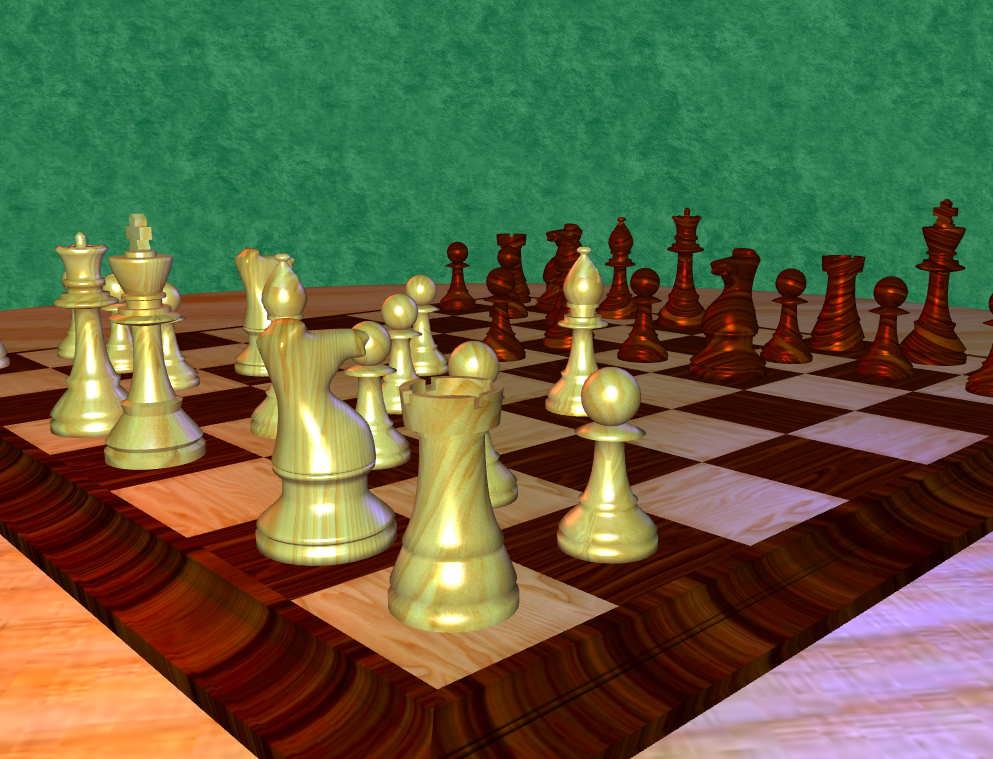
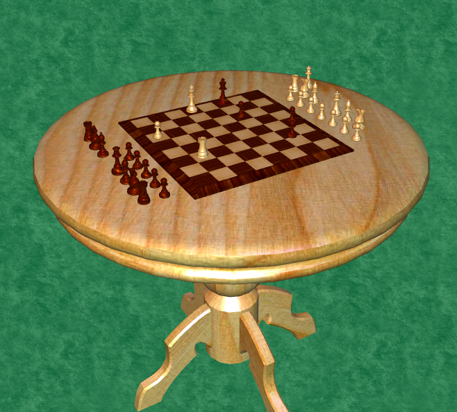
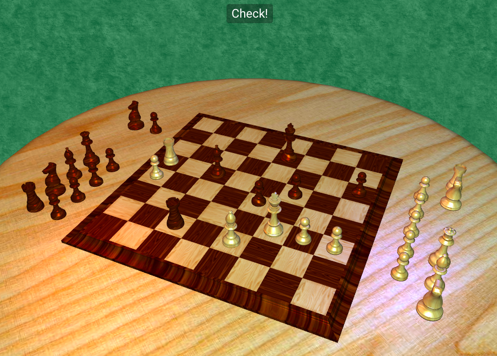

# webgl-chess
Final project for HCI 557: Computer Graphics and Geometric Modeling at [Iowa State University](http://www.vrac.iastate.edu/hci/)

 

 

 

## Features

- Utilizes [Stockfish](https://stockfishchess.org/) Chess AI to generate chess moves for both players client-side
  - Before you ask :smile:: no, you can't move the pieces yourself!  This level of interactivity was beyond the scope of this class project.  This is next on my to-do list if I get bored or inspired.
- Full camera navigation using mouse (click + drag and scroll wheel), keyboard (arrow keys + `-` and `+`), and mobile gestures (drag to pan, pinch to zoom, two-finger rotate)
- Supports standard chess play - castling, substitution, check, etc.

## Options

The following options are configurable through URL parameters (i.e., `http://nathanfriend.io/webgl-chess/#/3d?showMetrics=true`):
- `showMetrics=true` adds a framerate graph overlay to the corner of the screen
- `moveHistory=...` allows the game to start part-way through a game by providing the history of previous moves.  The value of this parameter should be a URL-encoded array of string moves.
  - [Here's an example](http://nathanfriend.io/webgl-chess/#/3d?moveHistory=%5B%22d4%22,%22d5%22,%22Nf3%22,%22e6%22,%22c4%22,%22Nf6%22,%22e3%22,%22Be7%22,%22Nc3%22,%22O-O%22,%22cxd5%22,%22exd5%22,%22Bd3%22,%22c5%22,%22O-O%22,%22Bg4%22,%22h3%22,%22Bxf3%22,%22Qxf3%22,%22Nc6%22,%22dxc5%22,%22Bxc5%22,%22Bc2%22,%22Re8%22,%22Rd1%22,%22d4%22,%22Ba4%22,%22Qc7%22,%22Bxc6%22,%22bxc6%22,%22Na4%22,%22Bb6%22,%22Nxb6%22,%22axb6%22,%22exd4%22,%22Nd5%22,%22a3%22,%22Ra4%22,%22Qd3%22,%22b5%22,%22Be3%22,%22Re6%22,%22Rac1%22,%22h6%22,%22Re1%22,%22Qa7%22,%22Rc5%22,%22Qd7%22,%22Kh2%22,%22Nf4%22,%22Qf5%22,%22Nd5%22,%22Qc2%22,%22Qd6%2B%22,%22Kh1%22,%22Qd7%22,%20%22Qd3%22,%22Nxe3%22,%22fxe3%22,%22Rxd4%22,%22Qxd4%22,%22Qxd4%22,%22exd4%22,%22Rxe1%2B%22,%22Kh2%22,%22Re6%22,%22Kg3%22,%22Re3%2B%22,%22Kf4%22,%22Rb3%22,%22Rxc6%22,%22Rxb2%22,%22Rc8%2B%22,%22Kh7%22,%22d5%22,%22Rxg2%22,%22d6%22,%22Rd2%22,%22Ke5%22,%22g5%22,%22Rc5%22,%22Kg6%22,%22Rd5%22,%22f6%2B%22,%22Ke6%22,%22Re2%2B%22,%22Kd7%22,%22Kf7%22,%22Rxb5%22,%22h5%22,%22Rb7%22,%22Kf8%22,%22Kc8%22,%22Re8%2B%22,%22Kc7%22,%22Re3%22,%22a4%22,%22Rc3%2B%22,%22Kb6%22,%22Rd3%22,%22Kc6%22,%22Rc3%2B%22,%22Kd5%22,%22Rd3%2B%22,%22Ke6%22,%22Re3%2B%22,%22Kd7%22,%22Rxh3%22,%22Kc8%22,%22g4%22,%22d7%22,%22Rd3%22%5D%0D%0A) of starting a game shortly before a substitution
- `stockfishLog=true` turns on verbose console loging for all interactions with the Stockfish engine
- `msBetweenTurns=1000` sets the number of milliseconds to wait between turns.  The default is 2000.

## Technology

This project is built with the following technologies:

- Vanilla [WebGL](https://developer.mozilla.org/en-US/docs/Web/API/WebGL_API) for scene rendering
- [stockfish-js](https://github.com/exoticorn/stockfish-js) for chess AI, which utilizes [Web Workers](https://developer.mozilla.org/en-US/docs/Web/API/Web_Workers_API/Using_web_workers)
- [chess-js](https://github.com/jhlywa/chess.js) for move validation/piece placement and movement/check detection/etc.
- [Hammer.js](http://hammerjs.github.io/) for mobile gesture support
- [Robert Penner's Easing Functions](http://robertpenner.com/easing/) for animation easing
- Angular 1 and Angular Material for UI interaction
- [TypeScript](https://www.typescriptlang.org/), [SASS](http://sass-lang.com/), [Gulp](http://gulpjs.com/), [Webpack](https://webpack.github.io/), [Yarn](https://yarnpkg.com/) 
- [Modernizr](https://modernizr.com/) for browser feature detection

## Building/Running

- Install [node.js](https://nodejs.org/en/) and [yarn](https://yarnpkg.com/en/docs/install)
- Run `yarn` at the root of this repository
- Run `yarn build`
- Set up a local webserver to serve the `build` directory

## Developing 

- Use `gulp build:watch` to watch for file changes and rebuild automatically
- Use `gulp test` or `gulp test:watch` to run unit tests
- Use the included Yoeman generator to scaffold out new Angular components for this application.  Instructions on how to use this generator can be found in the generator's README.

## Browser Support

Browser support for this project is limited by the use of two essential technologies: [Web Workers](https://developer.mozilla.org/en-US/docs/Web/API/Web_Workers_API/Using_web_workers) and [WebGL](https://developer.mozilla.org/en-US/docs/Web/API/WebGL_API).  This project should run in the following browsers:

- IE 11
- Edge
- Chrome
- Safari
- Firefox

Note that this project has not been thoroughly tested in browsers other than Chrome.  For best results, use Chrome.

## Sources

ChessJS was built with a lot of help.  A big thanks to following sources:

- Chess piece `.obj`'s from http://blender.freemovies.co.uk/modelling-making-a-chess-set/
- Table model from http://www.turbosquid.com/FullPreview/Index.cfm/ID/167072
- Wood textures from http://www.myfreetextures.com/ and http://bgfons.com/download/1582
- Green background from http://www.zingerbug.com/background.php?MyFile=green_parchment_paper_wallpaper_texture_seamless.php&ID=C732.php
- "Chess" font for chess icons in 2D mode from http://www.dafont.com/chess.font

## Tools

Here's what I used to make `webgl-chess`:

- [Visual Studio Code](https://code.visualstudio.com/) for editing
- [Blender](https://www.blender.org/) and [Gimp](https://www.gimp.org/) for object modeling and texture mapping/editing

